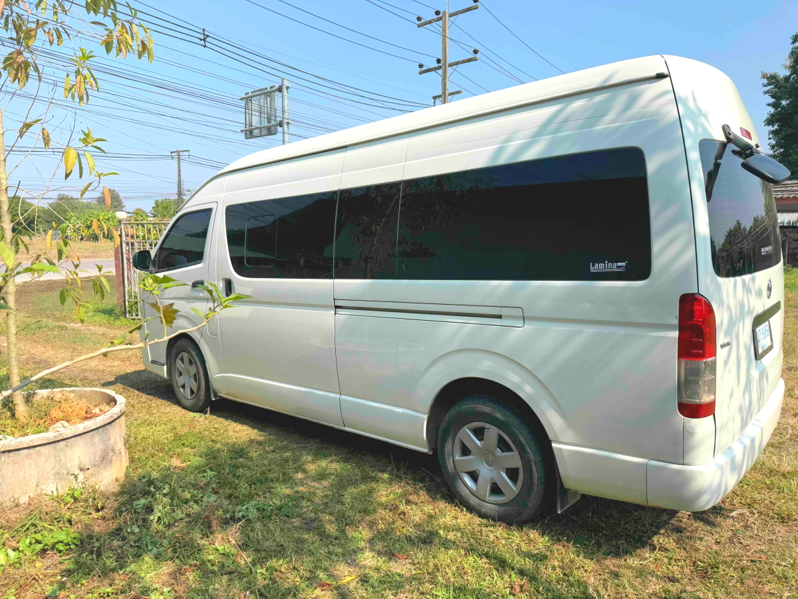
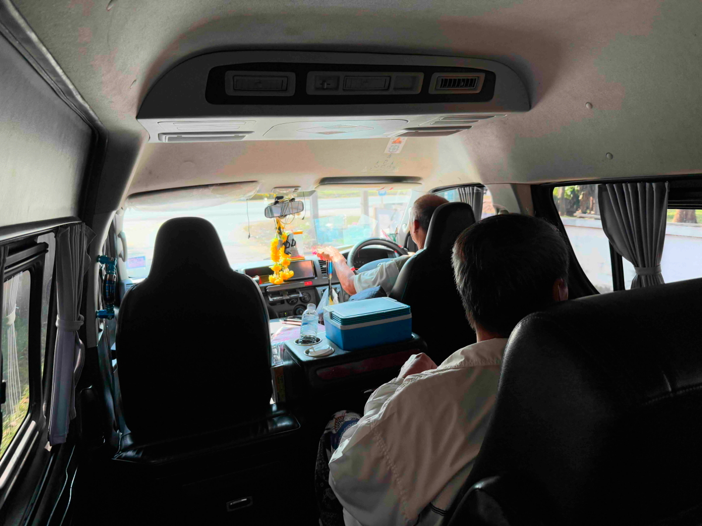
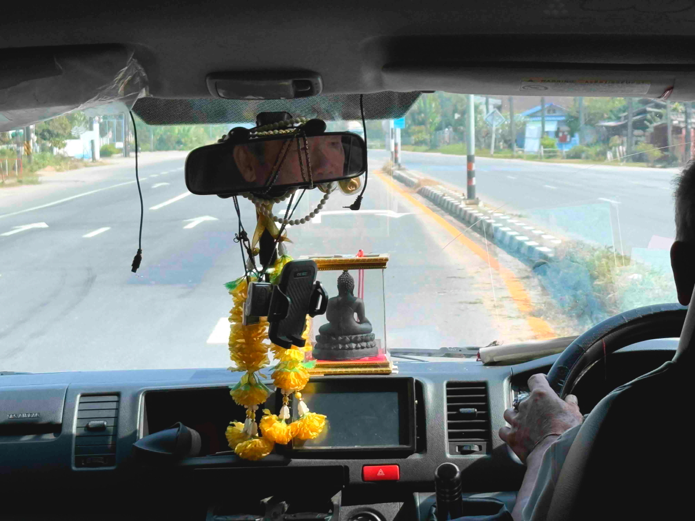
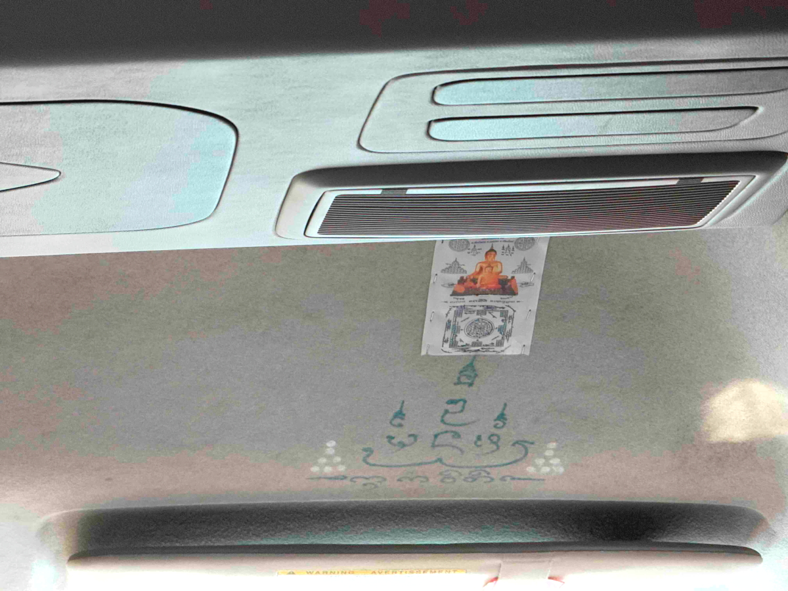
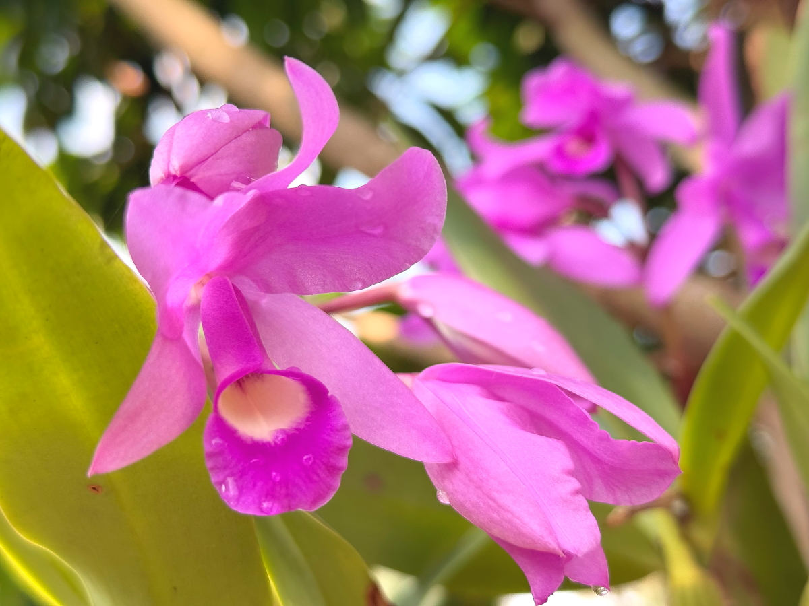
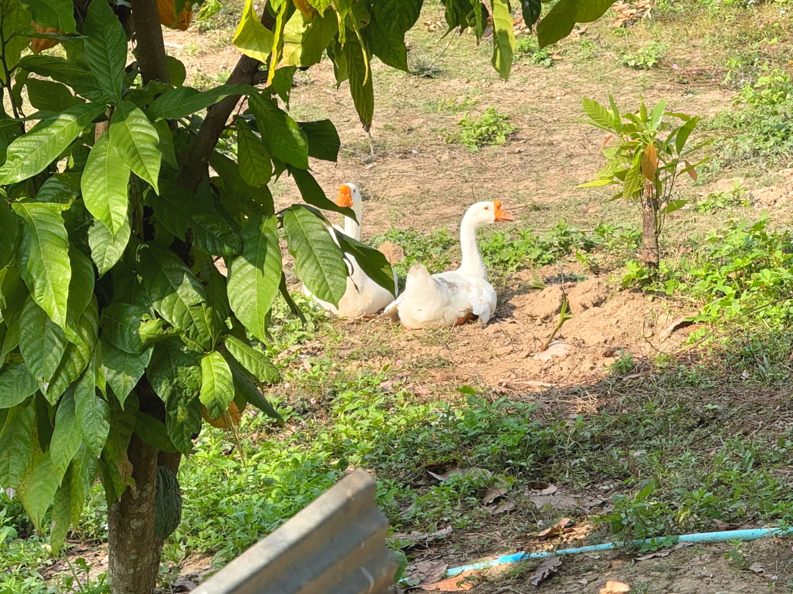

# 20250107_chiangrai

<html>
<head>

<meta charset="UTF-8">
<meta http-equiv="Content-Type" content="text/html; charset=UTF-8">
<meta http-equiv="X-UA-Compatible" content="IE=EmulateIE10" />
<meta http-equiv="X-UA-Compatible" content="IE=edge">

<!--ここから上はお決まりの定型文です-->

<!--ここからが表現の書式などを決めるcssという部分-->

<link href="https://cdnjs.cloudflare.com/ajax/libs/lightbox2/2.7.1/css/lightbox.css" rel="stylesheet">

</head>

<body>

モバイル端末をお使いの場合は、画面を横向きにすると
より見やすくご覧頂けます。

<!--ここ上は、ほぼそのまま使います！-->

<!--QRコードの挿入例-->

 アクセス用QRコード

<marquee direction="left" scrollamount="20" width="30%">(^_^)/~alis</marquee>

<!--流れ文字の挿入例-->
<h1><marquee behavior="left">!!! 2025/01/07 、仏教国タイの特徴的な部分をピックアップ !!!</marquee></h1>

                          

<!--ここから下が、本体部分-->

<h2>既出の画像ですが、タイ人の車のインパネに鎮座する仏像 この車にはルームミラーからもぶら下がってます</h2>

<h2>最新のEVタクシーには珍しく仏像さんは居ませんでした</h2>

<h2>通行している道にはお祈りする仏像様がいます</h2>

<h2>各家庭の庭には仏壇は必ずあります</h2>

<h2>お寺の塔は金箔が施されて、夜にはライトアップ！</h2>

<h2>車で2時間ほどのチェンマイから知り合いがドライバー付きのレンタカーで来てくれたので乗ってみました</h2>

<h2>インパネ周りは仏教色が色濃く出てます</h2>

<h2>仏像様のサイズは特大でした</h2>

<h2>インパネのみならず、Dr席のルーフにも何か描かれています</h2>

<h2>以上、今回はちょっと毛色の違った話でしたが、ここまで観ていただきありがとうございました。</h2>

     
<h2>
<a href="https://torokoid.github.io/20241126_chiangrai/" target="_blank">Back to the menu page</a>
</h2>

   

         

  

      

<!--本体はここまで-->

<!--画面に空白地帯を作って、背景が見えるようにしています-->
                                              

<!-- フッタ -->
<footer>

Copyright 2025/01/08 alis @ChiangRai

</footer>

<!--HPにさまざまなJavaScriptを呼び込むための書式-->

